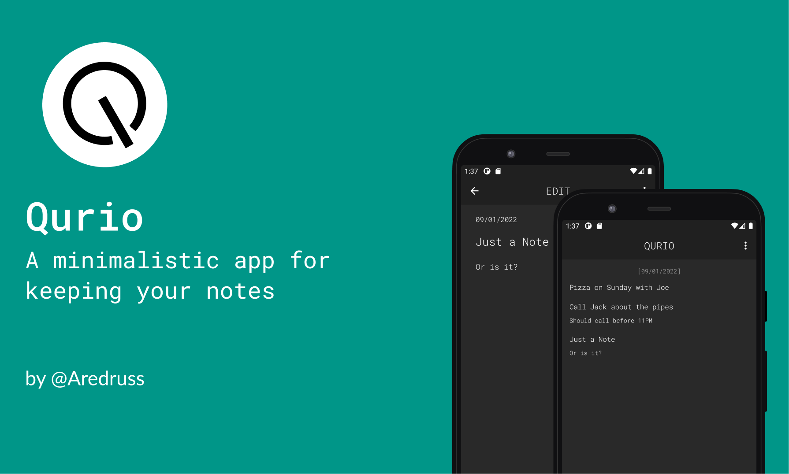

# Qurio Notes
## A minimalistic notepad

## About
This project was created to explore my own UI/UX design capabilities.
It offers clean and efficient functionality, and is designed to distract the user as little as possible.

## Day Mode 
Home | Create a note | Edit a note | About | Share or save a note
--- | --- | --- |--- |--- 
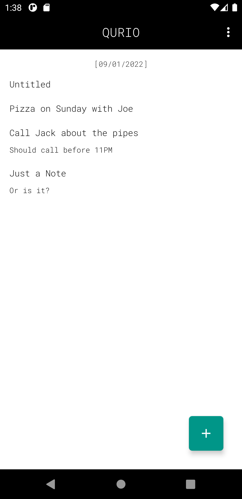 | 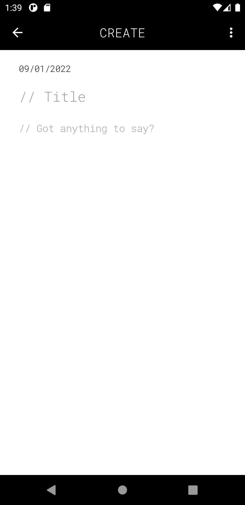 | 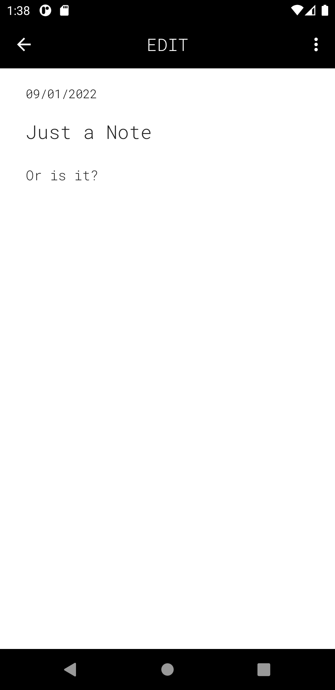 | 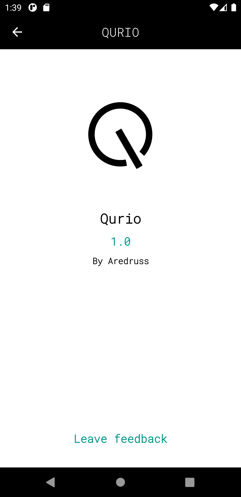 | 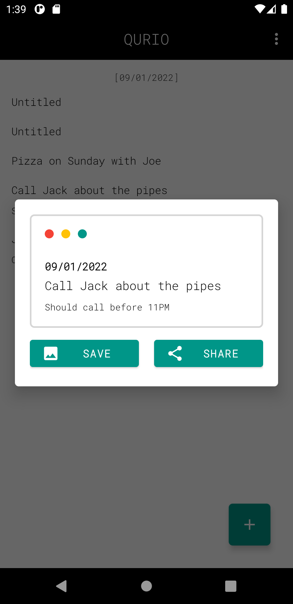

 

## Dark mode
Home | Create a note | Edit a note | About | Share or save a note
--- | --- | --- |--- |--- 
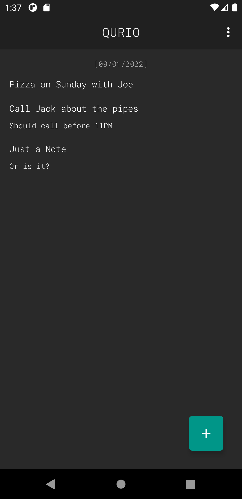 | 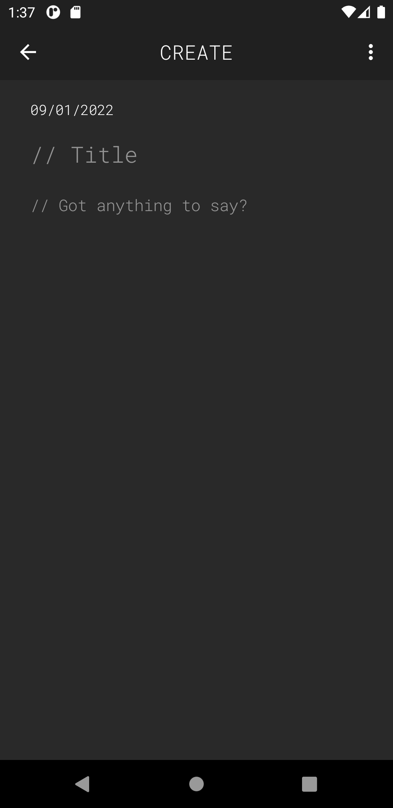 | 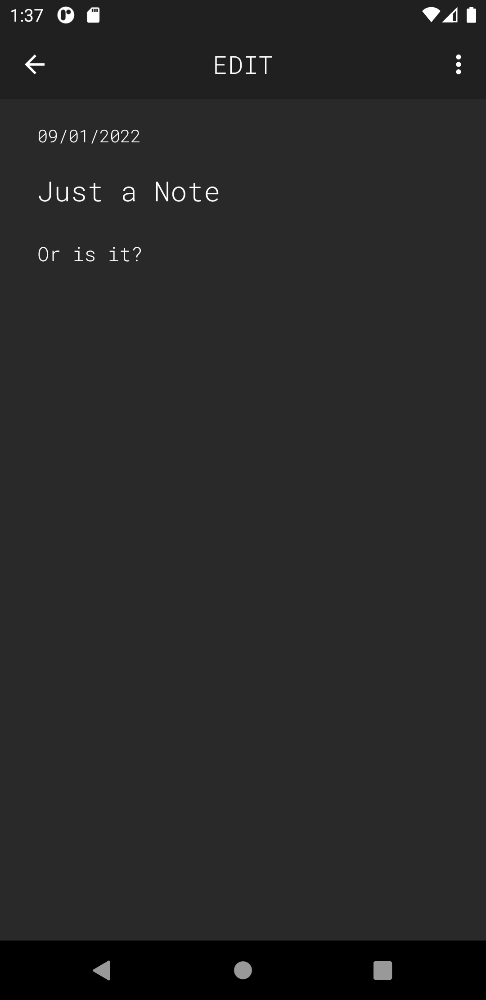 | 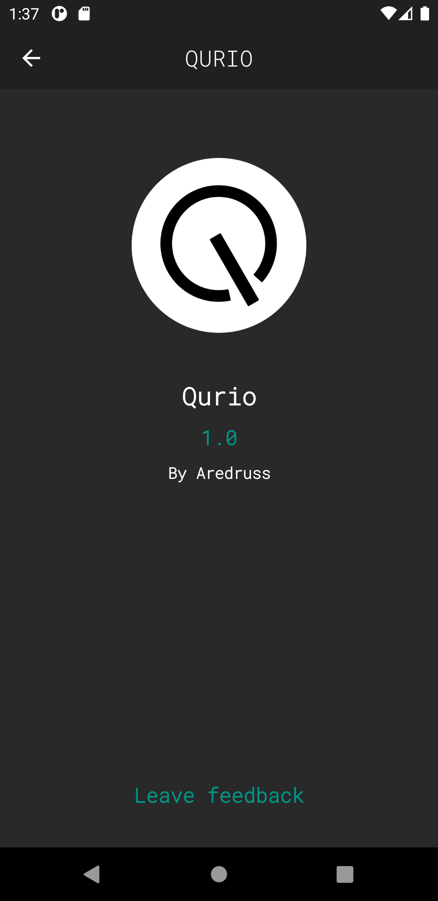 | 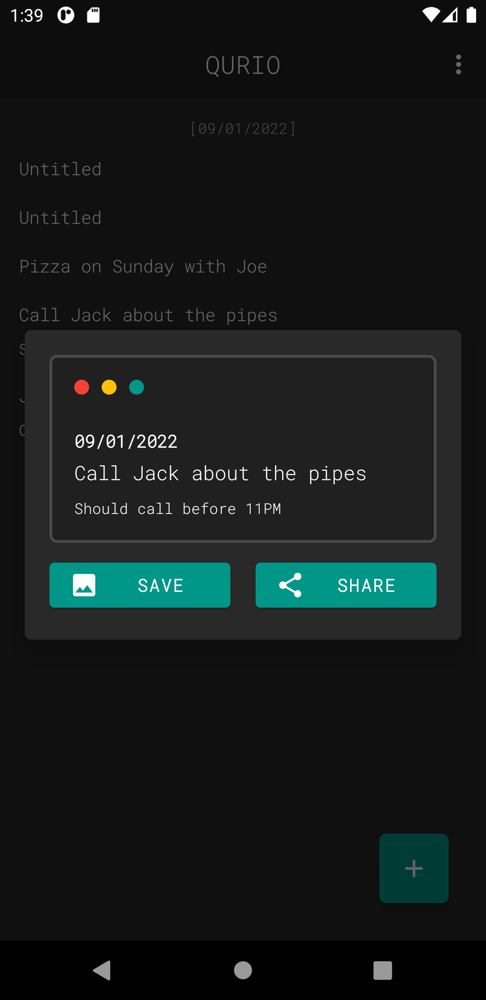
 

## Built With 
- [Kotlin](https://kotlinlang.org/) - First class and official programming language for Android development.
- [Koin](https://insert-koin.io/) - A smart Kotlin dependency injection librar  
- [Coroutines](https://kotlinlang.org/docs/reference/coroutines-overview.html) - For asynchronous and more..
- [Android Architecture Components](https://developer.android.com/topic/libraries/architecture) - Collection of libraries that help you design robust, testable, and maintainable apps.
    - [Flow](https://kotlinlang.org/docs/reference/coroutines/flow.html) - A flow is an asynchronous version of a Sequence, a type of collection whose values are lazily produced.
    - [ViewModel](https://developer.android.com/topic/libraries/architecture/viewmodel) - Stores UI-related data that isn't destroyed on UI changes.
    - [Room](https://developer.android.com/topic/libraries/architecture/room) - SQLite object mapping library.
    - [Jetpack Navigation](https://developer.android.com/guide/navigation) - Navigation refers to the interactions that allow users to navigate across, into, and back out from the different pieces of content within your app
- [Material Components for Android](https://github.com/material-components/material-components-android) - Modular and customizable Material Design UI components for Android.
- [Figma](https://figma.com/) - Figma is a vector graphics editor and prototyping tool which is primarily web-based.

 

## Package Structure 📦

    com.aredruss.qurio # Root Package
    ├── di                  # Koin DI Modules 
    ├── domain              # Local Data Storage
    │   ├── database        # Database Instance and the Data Access Object for Room
    ├── model               # Model classes [Notes]
    |-- repo                # Used to handle all data operations
    ├── view                # Activity/Fragment View layer
    │   ├── about           # App's summary
    │   ├── home            # App's Home
    │   ├── notes           # Create and Edit notes
    │   ├── utils           # Base classes and extensions
    ├── helpers             # All extension functions and utilities

 

## Architecture 
This app uses [MVVM](https://developer.android.com/jetpack/docs/guide#recommended-app-arch) architecture.

## Credits 🤗

- 📄 Special Thanks to [gmk57](https://github.com/gmk57) for all the cool gists

 

## License 